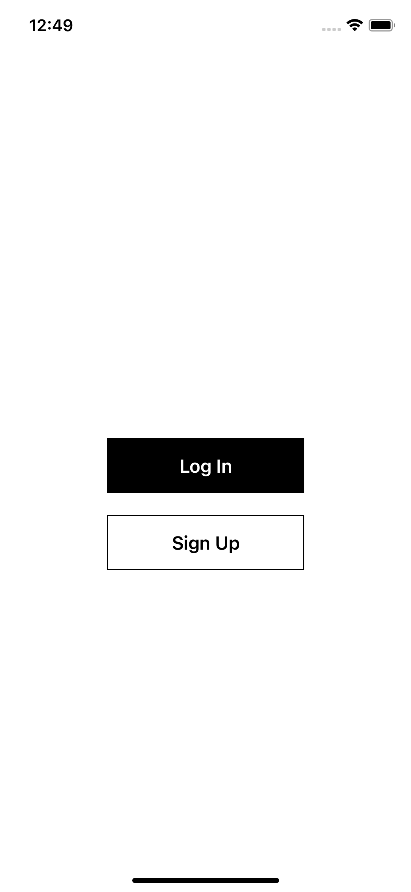

# SwiftUIFirebase
SwiftUI boilerplate code for an app with Firebase sign up/sign in and persistent log in user data with firestore

uses firebase authentification sdk and firestore sdk to create and log in with a user who's data persists through firestore. login persists by listening to a authorization state handler. custom error messages on each page. 

you will need to generate a GoogleService-Info.plist

User is tied with a full name and a counter number that they can change which saves
